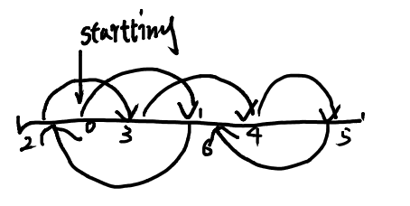
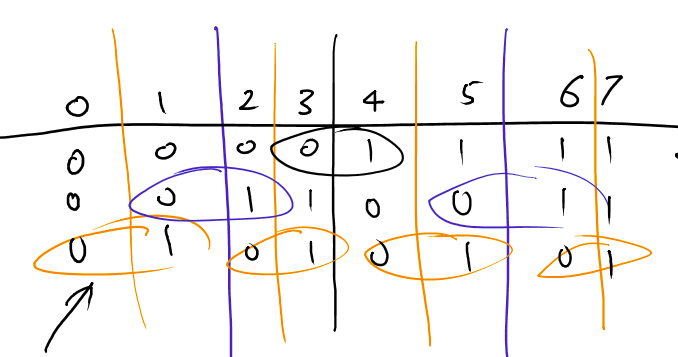

# Lecture 03

## 引子



如图，现在假设我们有一个存在 array 中的链表，
然后我们需要将其依序存在 array 中（就是把这个链表弄弄直）。

在线性算法中，我们需要 $O(n)$ 的时间来完成这个需求。
现在我们需要并行地完成它，
你会马上想到利用我们前面学过的建树来解决这个问题，
但是如果对每个元素直接建树，你会发现每次只能缩减一个（如下图）。
这不是我们想要的。


## 链表建树

在之前的课中，我们利用二分的策略来完成我们的建树工作，而在链表中，相似的，
我们引入 pointer jumping 的概念：

```javascript
A[i].next = A[i].next.next;
```


先看第一层，我们首先找到当前一个链表中的最大无关集（图中画了下滑线的点，后文我们会描述相关算法）。
找到最大无关集后我们对其和其 next 节点进行建树，由于是无关集，
所以保证了不会发生上面那个坏树的情况。
从第一层到第二层，我们可以发现相邻两个节点被合并，
而孤节点则直接被拉上来（通过 pointer jumping）。
这个过程我们称为 symmetry breaking。
重复这个过程，我们就能建出一颗树。

每次合并我们缩减的数值为这个 maximal independent set 的数值。
在最坏情况下，我们取到的 maximal independent set 为 $\frac{n}{3}$。

像这样：

[$a_0$, $\underline{a_1}$, $a_2$, $a_3$, $\underline{a_4}$, $a_5$]

所以最坏情况下我们有 $n_{i+1}=\frac{2}{3}n_i$，
所以这一部分我们需要 $\log_{1.5}{n}$ 步数。

注：由于是直接取指针，不是赋值，所以不要担心层迭代时的性能。

注2：

- __maximal independent set__: could not add one more point

- __maximum independent set__: number is max

如：

[$a_0$, $\underline{a_1}$, $a_2$, $\underline{a_3}$, $a_4$] 是一个 maximal independent set，因为不能再加入任意一个点了，但它在数值上不是最大的。
maximum independent set 应该是 [$\underline{a_0}$, $a_1$, $\underline{a_2}$, $a_3$, $\underline{a_4}$]

这里我们讨论的都是 maximal 的情况，因为 maximum 往往并不好找。

## 寻找链表中最大无关集

### 当我们有个染好色的链表

现在假设我们有一个染好色的链表，一共三种颜色，
而且我们保证了相邻两个节点不会有相同的颜色：

<script type="text/x-mathjax-config">
  MathJax.Hub.Config({ TeX: { extensions: ["color.js"] }});
</script>

[$\color{red} a_0$, $\color{green} a_1$, $\color{red} a_2$, $\color{blue} a_3$, $\color{red} a_4$, $\color{green} a_5$, $\color{blue} a_6$]

然后我们从里面取一个颜色，比如红色，就能取到一个无关集。

[$\color{red} \underline{a_0}$, $\color{green} a_1$, $\color{red} \underline{a_2}$, $\color{blue} a_3$, $\color{red} \underline{a_4}$, $\color{green} a_5$, $\color{blue} a_6$]

然后我们在对蓝色的每一个元素做检查，如果其相邻元素不在当前的 set 中，就插入。
这样我们就可以得到一个最大无关集。

[$\color{red} \underline{a_0}$, $\color{green} a_1$, $\color{red} \underline{a_2}$, $\color{blue} a_3$, $\color{red} \underline{a_4}$, $\color{green} a_5$, $\color{blue} \underline{a_6}$]

注：对同样的颜色，我们可以并行处理，因为同样的颜色必然不相邻，所以是安全的。

### 那么如何染色呢？



显然，我们知道对一条链表的各个点的染色可以等价为对点间连线的染色问题。
那么我们要保证的就是让任意相邻的两条边颜色不一致。

如图，我们在 $3$ 和 $4$ 之间画一条竖线，
那么对于所有 forward 过这条线的 link（比如 $2\rightarrow5$ 和 $3\rightarrow4$），
我们染上一样的色。因为对于横跨同一条线的两条边，它们必然是相邻的。因为你想，如果这两条边相邻，
那么必然有两个点对到一个点，这在我们讨论的链表中不可能。
同理我们把所有 backward 过这条线的 link 染上另一种颜色。

然后我们再四分之，对于各自 forward / backward 过线的 link 然后新的两种颜色。

这样我们可以在 $\log{n}$ 的时间内染好所有色，一共用掉 $2\log{n}$ 种颜色。

那么如何验证一条 link 是否 forward 或者 backward 一条分界线呢？
我们来看上面这张图。第一行是 array 的 index，下面是其二进制。
我们注意到对于跨过 $3$ 和 $4$ 的分隔线的两点，其最高位的 bit 不一致。
对于跨过 $1$ 和 $2$ 的分割线的两点，其最高位一致，但是次高位不一致。
$0$ 和 $1$ 之间的分割线同理。

## TODO 树的整合

## TODO 与之前的算法整合
