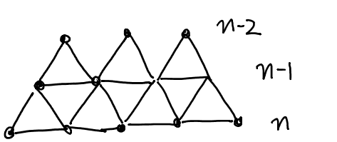

# Lecture 03

## 引子


如图，现在假设我们有一个存在 array 中的链表，
然后我们需要将其依序存在 array 中（就是把这个链表弄弄直）。

在线性算法中，我们需要 $O(n)$ 的时间来完成这个需求。
现在我们需要并行地完成它，
你会马上想到利用我们前面学过的建树来解决这个问题，
但是如果对每个元素直接建树，你会发现每次只能缩减一个（如下图）。
这不是我们想要的。



在之前的课中，我们利用二分的策略来完成我们的建树工作，而在链表中，相似的，
我们引入 pointer jumping 的概念：

```javascript
A[i].next = A[i].next.next;
```


先看第一层，我们首先找到当前一个链表中的最大最大无关集（后文我们会描述算法）。

## 寻找链表中最大无关集
