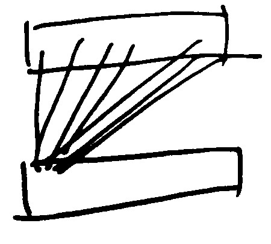
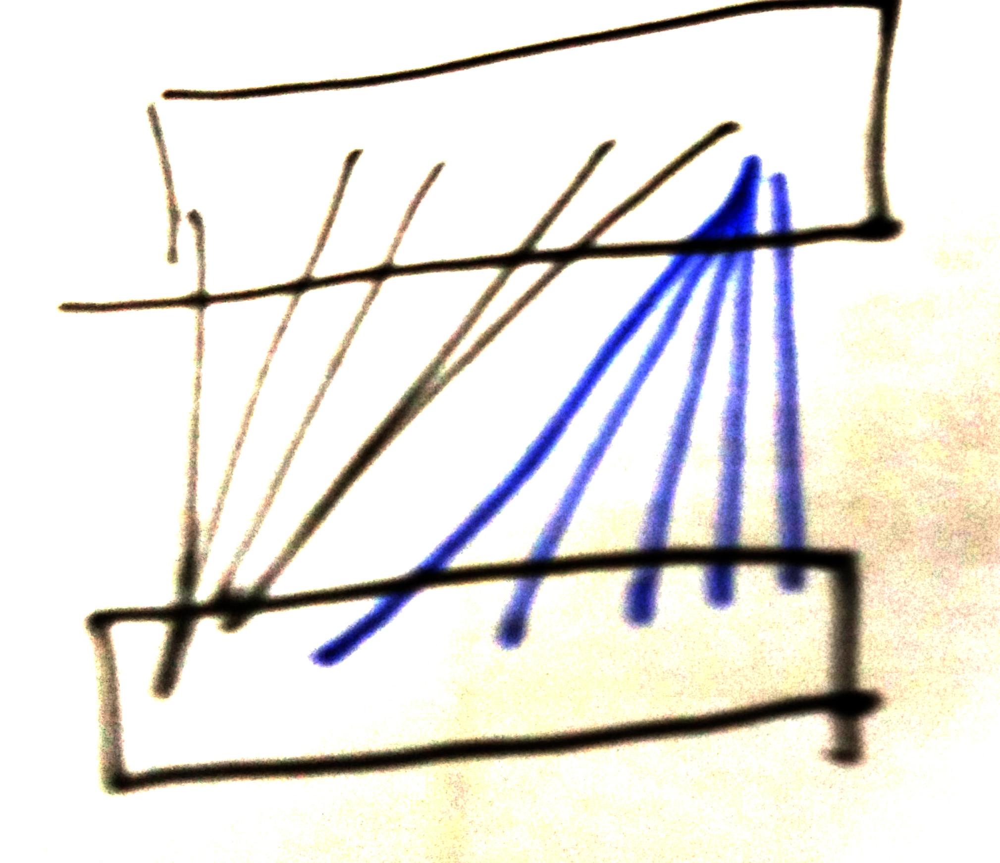

# Lecture 05

## 08:00-09:00 讲的，不知道叫什么

这一部分具体可以看郭翀的视频。

首先我们 coloring。

首先我们 build 一个 table ($\frac{n}{\log\log{n}}$ cols $times$ $\log\log{n}$ rows)，把所有的点都丢进去。
然后一些点被 pair off，这样点就下来，有的快，有的慢，所以参差不齐。

pair off 策略：

- If both are top nodes, storing the lower one

- If both are top nodes, and same height, storing either one

The min weight is 1, the max weight is $\log{n}$,
the total weight is $\frac{n}{\log\log{n}}(1+2+4+...)$

我们需要　$\frac{n}{\log{n}}$ processors 和　$\frac{n}{p}+\log{n}$ time。

Pack: $\frac{n}{p} + \log{n}$。

这个算法用于初步缩减 n 的数量使之小于　$n\log{n}$。
这样我们之后就可以用　pointer jumping。

这里我们说的高度为其格数，然后其　weight 为 1, 2, 4, 8...
然后我们就可以证明经过一次　round，总 weight 至少减少　$\frac{1}{4}$。

由于　$weight > 1$，所以必然有　$count(nodes) > \sum{weight}$。

## Bitonic Merging

假设我们有两个**排好序**的数列，他们方向相反，我们把他们接起来

$$
2 - 5 - 7 - 8 - 10
$$

$$
12 - 4 - 0
$$

然后二分

$$
\begin{xy}
\xymatrix {
      2 \ar@/^2pc/ [rrrrr]
    & 5 \ar@/^2pc/ [rrrrr]
    & 7 \ar@/^2pc/ [rrrrr]
    & 8 \ar@/^2pc/ [rrrrr]
    & |
    & 10
    & 12
    & 4
    & 0 \ar
}
\end{xy}
$$

交换，将小数置前

$$
\begin{xy}
\xymatrix {
      2
    & 5
    & 4
    & 0
    & |
    & 10
    & 12
    & 7
    & 8
}
\end{xy}
$$

再对半分

$$
\begin{xy}
\xymatrix {
      2 \ar@/^2pc/ [rrr]
    & 5 \ar@/^2pc/ [rrr]
    & |
    & 4
    & 0
    & |
    & 10 \ar@/^2pc/ [rrr]
    & 12 \ar@/^2pc/ [rrr]
    & |
    & 7
    & 8
}
\end{xy}
$$

交换，将小数置前

$$
\begin{xy}
\xymatrix {
      2
    & 0
    & 4
    & 5
    & 7
    & 8
    & 10
    & 12
}
\end{xy}
$$

再二分

$$
\begin{xy}
\xymatrix {
      2 \ar@/^2pc/ [r]
    & 0
    & 4 \ar@/^2pc/ [r]
    & 5
    & 7 \ar@/^2pc/ [r]
    & 8
    & 10 \ar@/^2pc/ [r]
    & 12
}
\end{xy}
$$

交换，将小数置前，这就是我们最终 merge 的结果了

$$
\begin{xy}
\xymatrix {
      0
    & 2
    & 4
    & 5
    & 7
    & 8
    & 10
    & 12
}
\end{xy}
$$

我们需要 $\log{n}$ steps，然后时间复杂度为 $O(\frac{n}{p}\log{n}+\log{n})$。

## Bitonic Sorting

假设我们有这个数组需要排序。

$$
\begin{xy}
\xymatrix {
      7 \ar@/^2pc/ [r]
    & 5
    & 4 \ar@/^2pc/ [r]
    & 3
    & 8 \ar@/^2pc/ [r]
    & 6
    & 2 \ar@/^2pc/ [r]
    & 1
}
\end{xy}
$$

我们将对象分为４组，每组我们将左边当成是一个数列，右边当成一个数列，我们做　Bitonic Merging。
这样我们得到了：

$$
5 - 7 - | - 3 - 4 - || - 6 - 8 - | - 1 - 2
$$

然后我们将对象分为 2 组，每组我们将左边两个数当成一个数列，右边两个数当成一个数列。
我们再做　Bitonic Merging。

这样有了：

$$
3 - 4 - 5 - 7 - | - 1 - 2 - 6 - 8
$$

我们再做一次　Bitonic Merging，
就得到了 Sorting 的结果。

Bitonic Sorting 的时间复杂度为：$O(\frac{n}{p}\log^2{n}+\log^2{n})$。

Hint: 如果需要简单的估算复杂度，可以直接取中间一段的最小值然后乘以那一段的 steps 作为下界。
对于上界，可以用最大复杂度乘以总体的 steps。

## Valiant's Merging

现在假设我们有两条排好序的数列，长度分别为 $n$ 和 $m$，然后我们有 $m+n$ 个 processors。

对于 $n$ 我们每 $\sqrt{n}$ 取一个节点，一共取出 $\sqrt{n}$ 个节点。
对于 $m$ 我们每 $\sqrt{m}$ 取一个节点，一共取出 $\sqrt{m}$ 个节点。
对于每个点，我们将其与另一条线上的所有点相连。
这样一来我们一共得到了 $\sqrt{mn}$ 条 links。

$$
\newcommand{\node}[1]{
    \enclose{circle}[mathcolor="black", padding="10px", thickness="1px"]{\color{black}{#1}}
}
$$

$$
\begin{xy}
\xymatrix {
    \node{0}
    & \node{\sqrt{n}}　\ar[ld] \ar[d] \ar[rd] \ar[rrd] \ar[rrrd]
    & \node{2\sqrt{n}}
    & \node{3\sqrt{n}}
    & \node{4\sqrt{n}}
    &...
    \\
    \node{0}
    & \node{\sqrt{m}}
    & \node{2\sqrt{m}}
    & \node{3\sqrt{m}}
    & \node{4\sqrt{m}}
    &...
}
\end{xy}
$$

对每条边我们比较两边的大小。这样一共需要计算 $\sqrt{mn}$ 次，通过不等式，
我们很容易证明 $\sqrt{mn} < m + n$，所以处理器肯定是够用的。

$$
\begin{xy}
\xymatrix {
    \node{0}
    & \node{\sqrt{n}}　\ar[ld] \ar[d] \ar[rd] \ar[rrd] \ar[rrrd]
    & \node{2\sqrt{n}}
    & \node{3\sqrt{n}}
    & \node{4\sqrt{n}}
    &...
    \\
    \node{0}
    & \node{\sqrt{m}}
    & \node{2\sqrt{m}}
    & \node{3\sqrt{m}}
    & \node{4\sqrt{m}}
    &...
    \\
    0 & 0 & 0 & 1 & 1 & ...
}
\end{xy}
$$

我们比较结果，如果小于则写 0 在那条边上，如果大于则写 1 在那条边上。
对于一个节点其第一个 0 - 1 交替的位置就是我们要找的位置。
这样我们知道将 $\sqrt{n}$ 这个节点要被插在 $2\sqrt{m}$ 和 $3\sqrt{m}$ 之间。

接下来我们要知道它具体要插在 $2\sqrt{m}$ 和 $3\sqrt{m}$ 之间哪个位置。
所以我们将 $\sqrt{n}$ 这个节点的值与 $2\sqrt{m}$ 和 $3\sqrt{m}$ 之间所有 $\sqrt{m}$ 个值进行比较。
而我们一共有 $\sqrt{n} \times \sqrt{m} + \sqrt{m} \times \sqrt{n}$ 次计算（课上说的好像是$m+n$？但是我和郭翀都觉得是 $2\sqrt{mn}$）要进行，
所以我们的处理器还是够的。

要注意的是，我们不能只做一边的，否则在极端情况下，比如第一条整条小于第二条的情况下，
算法会退化。

只有两边都做了，我们才能限定双向范围。

(Thanks to 邬凡, 黄TA, xqy)

还有要注意的是，我们每次 round 都只是标记（来限定范围）而已，
只有所有 round 结束了我们才会发生具体的操作。

经过上一步，我们初步对这 $\sqrt{m}$ 和 $\sqrt{n}$ 段进行了 merge。
接下来我们对每一条之前 link 对应的 $\sqrt{m} + \sqrt{n}$ 个数据，
我们已经知道了这 $\sqrt{m} + \sqrt{n}$ 的整体位置。

接下来，我们做和上一步一样的事情。这次一共有 $\sqrt{mn}$ 组，
每组有 $\sqrt{m} + \sqrt{n}$ 个数据。每组需要的处理器数是 $2(mn)^{\frac{1}{4}}$。
所以处理器还是够的。

这样不断迭代，一共 $\log{n}$ 代，我们就完成了整体的 merge。

要注意的是我们不可能出现交叉的情况：
$$
\begin{xy}
\xymatrix {
    A \ar[rd] & B \\
    C \ar[ru] & D
}
\end{xy}
$$
因为我们两个数列都是排好序的，已知了 $A < B$，$C < D$。
如果有 $B < C$ 则有 $B < D$，则 $A\rightarrow{D}$ 这条 link 并不该存在。

时间复杂度为：$O(\frac{n}{p}\log\log{n} + \log\log{n})$

## Valiant's Sorting

就是将利用之前 Bitonic Sorting 所述的方法，将 Merging 转换为 Sorting。

时间复杂度为：$O(\frac{n}{p}\log{n}\log\log{n} + \log{n}\log\log{n})$
